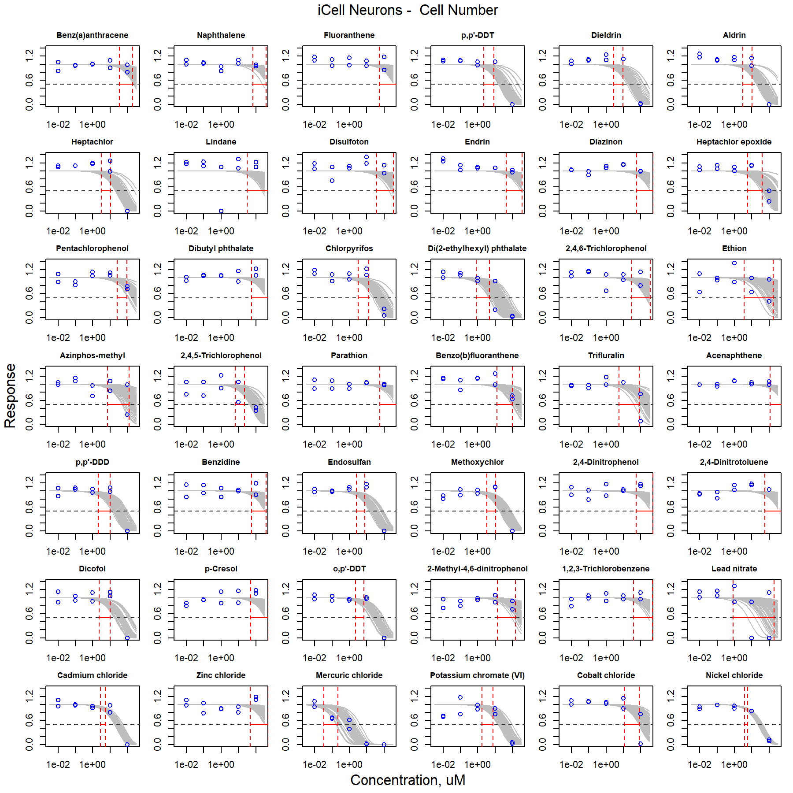
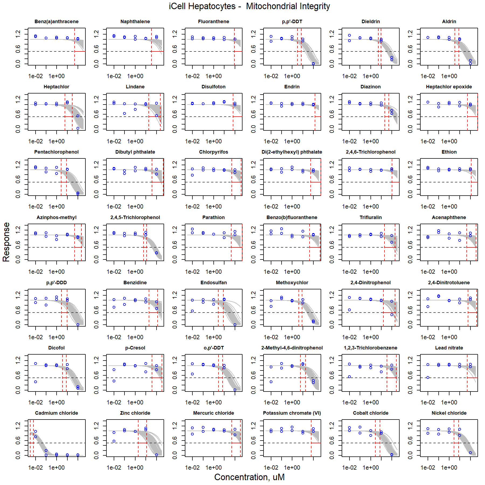
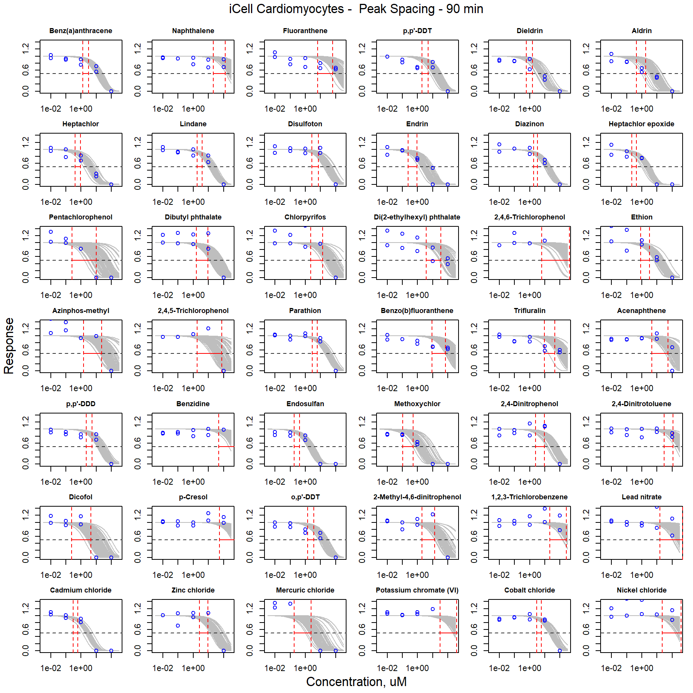
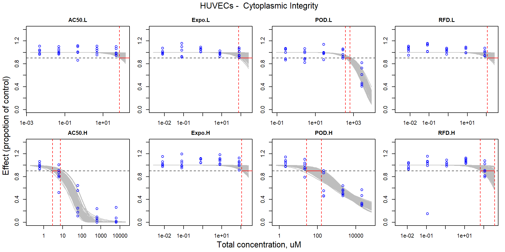

\hfill
<br>

$^*$ To whom correspondence should be addressed: 

Ivan Rusyn, MD, Ph.D., Department of Veterinary Integrative Biosciences, Texas A&M University, College Station, TX 77843; irusyn@cvm.tamu.edu

Weihsueh A. Chiu, Ph.D., Department of Veterinary Integrative Biosciences, Texas A&M University, College Station, TX 77843; wchiu@cvm.tamu.edu


$^{**}$ These authors contributed equally to this manuscript.

\newpage

```{r setup, include=FALSE}
knitr::opts_chunk$set(warning = F, echo = F, message = F, eval = T, comment = NA, background = c(0, 0, 0))
```

```{r, echo = F, eval= T}
# All used packages in this study were loaded here
library(rstan)
library(knitr)
library(jpeg)
library(tiff)
library(grid)
library(tidyverse)
library(reshape2)
library(scales)
library(ggpubr)
library(treemapify)
library(cowplot)
library(bayestestR)
library(ggridges)
library(gridExtra)
library(PerformanceAnalytics)
```

\listoftables
\listoffigures

\newpage

Supplementary Data
==================

The zip file contains the folder of R code (**codes**) and datasets (**datasets**) that can reproduce the modeling and analyze result (in **outputs** folder) and visualize plots (in **plots** folder) and final report (in **reports** folder). All data will publicly release on Github after the paper published. The details and data pipelines are included in:

- **codes:** The source code to reproduce the modeling and analyze result that include:
  - *hill_two.stan:* Stan code of Hill model for the concentration-response modeling.
  - *0_mcmc_ind_chems.R*: R code for conducting the Hamiltonian Monte chain Monte Carlo simulation for individual chemicals.
  - *1_mcmc_mixtures.R*: R code for conducting the Hamiltonian Monte chain Monte Carlo simulation for mixtures.
  - *2_ec_10_pred.R*: R code to to estimate curve-fitting and predicted EC$_\textrm{10}$ in mixture for each phenotype. 
  - *3_conc_resp_pred.R*: R code to reconstruct the concentration-response profiles. 
  - *4_plot.R*: R codes to generate the figures in manuscript.
  - *5_plot_suppl.R*: R codes to generate the same figures in Supplemental Materials.

- **datasets:** The provided tidy data files include the individual chemical information (*chem_info.csv*) and cell assay results (*chem_data.csv*). The mixture information and cell assay results can be found in *mix_info.csv* and *mix_data.csv*. The data files contained the following columns:
  - *chemical*: Name of chemical.
  - *mixture*: Name of mixture.
  - *Replication*: Replication number. Two replications were conducted in individual chemicals. The mixtures had six replication. 
  - *Concentration*: Experimental concentration (unit = micromole). 
  - *Dilution*: Diluted factor according to the designed concentration in mixture.
  - *Response*: Response proportion that had been normalized (0 - 1) based on the control group.
  - *celltype*: Name of human induced pluripotent stem cells-derived cells.
  - *phenotype*: Cytotoxicity and functional phenotypes for each cell.

- **outputs**: The files in the output folder are generated by the above R code and datasets. The Bayesain estimated model parameters for individual chemicals were named like *HUVECs_42_chem_params.rda*. Also, the mixtures were named like *HUVECs_mixtures_params.rda*. The outputs of curve-fitting and predicted EC$_\textrm{10}$ in the mixture for each phenotype were stored in *ec_10_pred.rda*. Also, the calculated outputs to reconstruct the mixture concentration-response profile are in *mix_CR.rda*. 

- **plots:** All plots showed in the manuscript were saved in this folder. The **suppl**  folder includes the supplementary figures that showed below.

\newpage

Supplementary Tables
====================

```{r, eval=T}
chem_info <- "datasets/chem_info.csv"
read.csv(chem_info) %>% kable(caption = "Table S1. The list of chemical that were be used in this study.")
```

\newpage

```{r, eval=T}
mix_info <- "datasets/mixture_info.csv"
read.csv(mix_info)[1:3] %>% 
  mutate(`AC50.L.p` = round(AC50.L/sum(AC50.L)*100, 2)) %>%
  mutate(`AC50.H.p` = round(AC50.H/sum(AC50.H)*100, 2)) %>%
  `colnames<-`(c("Chemical", "AC50-L (micromole)", "AC50-H (micromole)", "AC50-L (%)", "AC50-H (%)")) %>% kable(caption = "Table S2. The summary of the AC50-based designed mixture.")
```

\newpage

```{r, eval=T}
mix_info <- "datasets/mixture_info.csv"
read.csv(mix_info)[c(1,4,5)] %>% 
  mutate(`Expo.L.p` = round(Expo.L/sum(Expo.L)*100, 2)) %>%
  mutate(`Expo.H.p` = round(Expo.H/sum(Expo.H)*100, 2)) %>%
  `colnames<-`(c("Chemical", "Expo-L (micromole)", "Expo-H (micromole)", "Expo-L (%)", "Expo-H (%)")) %>% kable(caption = "Table S3. The summary of the exposure-based designed mixture.")
```

\newpage

```{r, eval=T}
mix_info <- "datasets/mixture_info.csv"
read.csv(mix_info)[c(1,6,7)] %>% 
  mutate(`POD.L.p` = round(POD.L/sum(POD.L)*100, 2)) %>%
  mutate(`POD.H.p` = round(POD.H/sum(POD.H)*100, 2)) %>%
  `colnames<-`(c("Chemical", "POD-L (micromole)", "POD-H (micromole)", "POD-L (%)", "POD-H (%)")) %>% kable(caption = "Table S4. The summary of the POD-based designed mixture.")
```

\newpage

```{r, eval=T}
mix_info <- "datasets/mixture_info.csv"
read.csv(mix_info)[c(1,8,9)] %>% 
  mutate(`RFD.L.p` = round(RFD.L/sum(RFD.L)*100, 2)) %>%
  mutate(`RFD.H.p` = round(RFD.H/sum(RFD.H)*100, 2)) %>%
  `colnames<-`(c("Chemical", "RFD-L (micromole)", "RFD-H (micromole)", "RFD-L (%)", "RFD-H (%)")) %>% kable(caption = "Table S5. The summary of the RFD-based designed mixture.")
```

\newpage

Supplementary Figures
======================

## Curve-fitting of single chemical concentration-respsonse

### iCell Neurons

```{r, out.width='\\textwidth', fig.height = 8, fig.align='center', fig.cap= "Figure S1. Curve-fitting of single chemical concentration and observed response (ATP) in iCell Neurons."}

```

```{r, out.width='\\textwidth', fig.height = 8, fig.align='center', fig.cap="Figure S2. Curve-fitting of single chemical concentration and observed response (Cell Number) in iCell Neurons."}

```


```{r, out.width='\\textwidth', fig.height = 8, fig.align='center', fig.cap="Figure S3. Curve-fitting of single chemical concentration and observed response (Cell with Significant Growth) in iCell Neurons."}

```


```{r, out.width='\\textwidth', fig.height = 8, fig.align='center', fig.cap="Figure S4. Curve-fitting of single chemical concentration and observed response (Cytoplasmic Integrity) in iCell Neurons."}

```


```{r, out.width='\\textwidth', fig.height = 8, fig.align='center', fig.cap="Figure S5. Curve-fitting of single chemical concentration and observed response (Mean Outgrowth) in iCell Neurons."}

```

```{r, out.width='\\textwidth', fig.height = 8, fig.align='center', fig.cap="Figure S6. Curve-fitting of single chemical concentration and observed response (Mitochondrial Integrity) in iCell Neurons."}

```

```{r, out.width='\\textwidth', fig.height = 8, fig.align='center', fig.cap="Figure S7. Curve-fitting of single chemical concentration and observed response (Total Branches) in iCell Neurons."}

```


```{r, out.width='\\textwidth', fig.height = 8, fig.align='center', fig.cap="Figure S8. Curve-fitting of single chemical concentration and observed response (Total Cells Body Area) in iCell Neurons."}

```


```{r, out.width='\\textwidth', fig.height = 8, fig.align='center', fig.cap="Figure S9. Curve-fitting of single chemical concentration and observed response (Total Outgrowth) in iCell Neurons."}

```


```{r, out.width='\\textwidth', fig.height = 8, fig.align='center', fig.cap="Figure S10. Curve-fitting of single chemical concentration and observed response (Total Process) in iCell Neurons."}

```


\clearpage

\newpage

### HUVECs


```{r, out.width='\\textwidth', fig.height = 8, fig.align='center', fig.cap="Figure S11. Curve-fitting of single chemical concentration and observed response (Cell Number) in HUVECs."}

```


```{r, out.width='\\textwidth', fig.height = 8, fig.align='center', fig.cap="Figure S12. Curve-fitting of single chemical concentration and observed response (Cytoplasmic Integrity) in HUVECs."}

```


```{r, out.width='\\textwidth', fig.height = 8, fig.align='center', fig.cap="Figure S13. Curve-fitting of single chemical concentration and observed response (Mean Tube Length) in HUVECs."}

```


```{r, out.width='\\textwidth', fig.height = 8, fig.align='center', fig.cap="Figure S14. Curve-fitting of single chemical concentration and observed response (Mitochondrial Intensity) in HUVECs."}

```


```{r, out.width='\\textwidth', fig.height = 8, fig.align='center', fig.cap="Figure S15. Curve-fitting of single chemical concentration and observed response (Mitochondrial Integrity) in HUVECs."}

```


```{r, out.width='\\textwidth', fig.height = 8, fig.align='center', fig.cap="Figure S16. Curve-fitting of single chemical concentration and observed response (Nuclei Mean Area) in HUVECs."}

```


```{r, out.width='\\textwidth', fig.height = 8, fig.align='center', fig.cap="Figure S17. Curve-fitting of single chemical concentration and observed response (Total Tube Area) in HUVECs."}

```


```{r, out.width='\\textwidth', fig.height = 8, fig.align='center', fig.cap="Figure S18. Curve-fitting of single chemical concentration and observed response (Total Tube Length) in HUVECs."}

```

\clearpage

\newpage

### iCell Hepatocytes

```{r, out.width='\\textwidth', fig.height = 8, fig.align='center', fig.cap="Figure S19. Curve-fitting of single chemical concentration and observed response (All Cell Mean Area) in iCell Hepatocytes."}

```


```{r, out.width='\\textwidth', fig.height = 8, fig.align='center', fig.cap="Figure S20. Curve-fitting of single chemical concentration and observed response (Cell Number) in iCell Hepatocytes."}

```


```{r, out.width='\\textwidth', fig.height = 8, fig.align='center', fig.cap="Figure S21. Curve-fitting of single chemical concentration and observed response (Mitochondrial Intensity) in iCell Hepatocytes."}

```


```{r, out.width='\\textwidth', fig.height = 8, fig.align='center', fig.cap="Figure S22. Curve-fitting of single chemical concentration and observed response (Mitochondrial Integrity) in iCell Hepatocytes."}

```


```{r, out.width='\\textwidth', fig.height = 8, fig.align='center', fig.cap="Figure S23. Curve-fitting of single chemical concentration and observed response (Nuclei Mean Area) in iCell Hepatocytes."}

```

\clearpage

\newpage

### iCell Endothelial cells

```{r, out.width='\\textwidth', fig.height = 8, fig.align='center', fig.cap="Figure S24. Curve-fitting of single chemical concentration and observed response (Cell Number) in iCell Endothelial cells."}

```


```{r, out.width='\\textwidth', fig.height = 8, fig.align='center', fig.cap="Figure S25. Curve-fitting of single chemical concentration and observed response (Cytoplasmic Integrity) in iCell Endothelial cells."}

```


```{r, out.width='\\textwidth', fig.height = 8, fig.align='center', fig.cap="Figure S26. Curve-fitting of single chemical concentration and observed response (Mean Tube Length) in iCell Endothelial cells."}

```


```{r, out.width='\\textwidth', fig.height = 8, fig.align='center', fig.cap="Figure S27. Curve-fitting of single chemical concentration and observed response (Mitochondrial Intensity) in iCell Endothelial cells."}

```


```{r, out.width='\\textwidth', fig.height = 8, fig.align='center', fig.cap="Figure S28. Curve-fitting of single chemical concentration and observed response (Mitochondrial Integrity) in iCell Endothelial cells."}

```


```{r, out.width='\\textwidth', fig.height = 8, fig.align='center', fig.cap="Figure S29. Curve-fitting of single chemical concentration and observed response (Nuclei Mean Area) in iCell Endothelial cells."}

```


```{r, out.width='\\textwidth', fig.height = 8, fig.align='center', fig.cap="Figure S30. Curve-fitting of single chemical concentration and observed response (Total Tube Area) in iCell Endothelial cells."}

```


```{r, out.width='\\textwidth', fig.height = 8, fig.align='center', fig.cap="Figure S31. Curve-fitting of single chemical concentration and observed response (Total Tube Length) in iCell Endothelial cells."}

```

\clearpage

\newpage

### iCell Cardiomyocytes

```{r, out.width='\\textwidth', fig.height = 8, fig.align='center', fig.cap="Figure S32. Curve-fitting of single chemical concentration and observed response (Beats Per Minute - 15 min) in iCell Cardiomyocytes."}

```


```{r, out.width='\\textwidth', fig.height = 8, fig.align='center', fig.cap="Figure S33. Curve-fitting of single chemical concentration and observed response (Beats Per Minute - 90 min) in iCell Cardiomyocytes."}

```


```{r, out.width='\\textwidth', fig.height = 8, fig.align='center', fig.cap="Figure S34. Curve-fitting of single chemical concentration and observed response (Cell Number) in iCell Cardiomyocytes."}

```


```{r, out.width='\\textwidth', fig.height = 8, fig.align='center', fig.cap="Figure S35. Curve-fitting of single chemical concentration and observed response (Peak Decay time - 15 min) in iCell Cardiomyocytes."}

```


```{r, out.width='\\textwidth', fig.height = 8, fig.align='center', fig.cap="Figure S36. Curve-fitting of single chemical concentration and observed response (Peak Decay time - 90 min) in iCell Cardiomyocytes."}

```


```{r, out.width='\\textwidth', fig.height = 8, fig.align='center', fig.cap="Figure S37. Curve-fitting of single chemical concentration and observed response (Decay to Rise Ratio - 15 min) in iCell Cardiomyocytes."}

```


```{r, out.width='\\textwidth', fig.height = 8, fig.align='center', fig.cap="Figure S38. Curve-fitting of single chemical concentration and observed response (Decay to Rise Ratio - 90 min) in iCell Cardiomyocytes."}

```


```{r, out.width='\\textwidth', fig.height = 8, fig.align='center', fig.cap="Figure S39. Curve-fitting of single chemical concentration and observed response (Mitochondrial Integrity) in iCell Cardiomyocytes."}

```


```{r, out.width='\\textwidth', fig.height = 8, fig.align='center', fig.cap="Figure S40. Curve-fitting of single chemical concentration and observed response (Peak Amplitude - 15 min) in iCell Cardiomyocytes."}

```


```{r, out.width='\\textwidth', fig.height = 8, fig.align='center', fig.cap="Figure S41. Curve-fitting of single chemical concentration and observed response (Peak Amplitude - 90 min) in iCell Cardiomyocytes."}

```


```{r, out.width='\\textwidth', fig.height = 8, fig.align='center', fig.cap="Figure S42. Curve-fitting of single chemical concentration and observed response (Peak Spacing - 15 min) in iCell Cardiomyocytes."}

```


```{r, out.width='\\textwidth', fig.height = 8, fig.align='center', fig.cap="Figure S43. Curve-fitting of single chemical concentration and observed response (Peak Spacing - 90 min) in iCell Cardiomyocytes."}

```


```{r, out.width='\\textwidth', fig.height = 8, fig.align='center', fig.cap="Figure S44. Curve-fitting of single chemical concentration and observed response (Peak Width - 15 min) in iCell Cardiomyocytes."}

```


```{r, out.width='\\textwidth', fig.height = 8, fig.align='center', fig.cap="Figure S45. Curve-fitting of single chemical concentration and observed response (Peak Width - 90 min) in iCell Cardiomyocytes."}

```


```{r, out.width='\\textwidth', fig.height = 8, fig.align='center', fig.cap="Figure S46. Curve-fitting of single chemical concentration and observed response (Peak Rise time - 15 min) in iCell Cardiomyocytes."}

```


```{r, out.width='\\textwidth', fig.height = 8, fig.align='center', fig.cap="Figure S47. Curve-fitting of single chemical concentration and observed response (Peak Rise time - 90 min) in iCell Cardiomyocytes."}

```

\clearpage

\newpage

## Curve-fitting of mixture concentration-respsonse

### iCell Neurons

```{r, out.width='\\textwidth', fig.height = 5, fig.align='center', fig.cap="Figure S48. Curve-fitting of mixture concentration and observed response (ATP) in iCell Neurons."}

```


```{r, out.width='\\textwidth', fig.height = 5, fig.align='center', fig.cap="Figure S49. Curve-fitting of mixture concentration and observed response (Cell Number) in iCell Neurons."}

```


```{r, out.width='\\textwidth', fig.height = 5, fig.align='center', fig.cap="Figure S50. Curve-fitting of mixture concentration and observed response (Cell with Significant Growth) in iCell Neurons."}

```


```{r, out.width='\\textwidth', fig.height = 5, fig.align='center', fig.cap="Figure S51. Curve-fitting of mixture concentration and observed response (Cytoplasmic Integrity) in iCell Neurons."}

```


```{r, out.width='\\textwidth', fig.height = 5, fig.align='center', fig.cap="Figure S52. Curve-fitting of mixture concentration and observed response (Mean Outgrowth) in iCell Neurons."}

```


```{r, out.width='\\textwidth', fig.height = 5, fig.align='center', fig.cap="Figure S53. Curve-fitting of mixture concentration and observed response (Mitochondrial Integrity) in iCell Neurons."}

```


```{r, out.width='\\textwidth', fig.height = 5, fig.align='center', fig.cap="Figure S54. Curve-fitting of mixture concentration and observed response (Total Branches) in iCell Neurons."}

```


```{r, out.width='\\textwidth', fig.height = 5, fig.align='center', fig.cap="Figure S55. Curve-fitting of mixture concentration and observed response (Total Cells Body Area) in iCell Neurons."}

```


```{r, out.width='\\textwidth', fig.height = 5, fig.align='center', fig.cap="Figure S56. Curve-fitting of mixture concentration and observed response (Total Outgrowth) in iCell Neurons."}

```

\clearpage

```{r, out.width='\\textwidth', fig.height = 5, fig.align='center', fig.cap="Figure S57. Curve-fitting of mixture concentration and observed response (Total Process) in iCell Neurons."}

```

\clearpage

\newpage

### HUVECs

```{r, out.width='\\textwidth', fig.height = 5, fig.align='center', fig.cap="Figure S58. Curve-fitting of mixture concentration and observed response (Cell Number) in HUVECs."}

```


```{r, out.width='\\textwidth', fig.height = 5, fig.align='center', fig.cap="Figure S59. Curve-fitting of mixture concentration and observed response (Cytoplasmic Integrity) in HUVECs."}

```


```{r, out.width='\\textwidth', fig.height = 5, fig.align='center', fig.cap="Figure S60. Curve-fitting of mixture concentration and observed response (Mean Tube Length) in HUVECs."}

```


```{r, out.width='\\textwidth', fig.height = 5, fig.align='center', fig.cap="Figure S61. Curve-fitting of mixture concentration and observed response (Mitochondrial Intensity) in HUVECs."}

```


```{r, out.width='\\textwidth', fig.height = 5, fig.align='center', fig.cap="Figure S62. Curve-fitting of mixture concentration and observed response (Mitochondrial Integrity) in HUVECs."}
include_graphics("plots/suppl/FigS62.png")
```


```{r, out.width='\\textwidth', fig.height = 5, fig.align='center', fig.cap="Figure S63. Curve-fitting of mixture concentration and observed response (Nuclei Mean Area) in HUVECs."}

```


```{r, out.width='\\textwidth', fig.height = 5, fig.align='center', fig.cap="Figure S64. Curve-fitting of mixture concentration and observed response (Total Tube Area) in HUVECs."}

```

\clearpage

```{r, out.width='\\textwidth', fig.height = 5, fig.align='center', fig.cap="Figure S65. Curve-fitting of mixture concentration and observed response (Total Tube Length) in HUVECs."}

```


\clearpage

\newpage

### iCell Hepatocytes

```{r, out.width='\\textwidth', fig.height = 5, fig.align='center', fig.cap="Figure S66. Curve-fitting of mixture concentration and observed response (All Cell Mean Area) in iCell Hepatocytes."}

```


```{r, out.width='\\textwidth', fig.height = 5, fig.align='center', fig.cap="Figure S67. Curve-fitting of mixture concentration and observed response (Cell Number) in iCell Hepatocytes."}

```


```{r, out.width='\\textwidth', fig.height = 5, fig.align='center', fig.cap="Figure S68. Curve-fitting of mixture concentration and observed response (Mitochondrial Intensity) in iCell Hepatocytes."}

```


```{r, out.width='\\textwidth', fig.height = 5, fig.align='center', fig.cap="Figure S69. Curve-fitting of mixture concentration and observed response (Mitochondrial Integrity) in iCell Hepatocytes."}

```


```{r, out.width='\\textwidth', fig.height = 5, fig.align='center', fig.cap="Figure S70. Curve-fitting of mixture concentration and observed response (Nuclei Mean Area) in iCell Hepatocytes."}

```


\clearpage

\newpage

### iCell Endothelial cells

```{r, out.width='\\textwidth', fig.height = 5, fig.align='center', fig.cap="Figure S71. Curve-fitting of mixture concentration and observed response (Cell Number) in iCell Endothelial cells."}
include_graphics("plots/suppl/FigS71.png")
```


```{r, out.width='\\textwidth', fig.height = 5, fig.align='center', fig.cap="Figure S72. Curve-fitting of mixture concentration and observed response (Cytoplasmic Integrity) in iCell Endothelial cells."}

```

```{r, out.width='\\textwidth', fig.height = 5, fig.align='center', fig.cap="Figure S73. Curve-fitting of mixture concentration and observed response (Mean Tube Length) in iCell Endothelial cells."}

```

```{r, out.width='\\textwidth', fig.height = 5, fig.align='center', fig.cap="Figure S74. Curve-fitting of mixture concentration and observed response (Mitochondrial Intensity) in iCell Endothelial cells."}

```

```{r, out.width='\\textwidth', fig.height = 5, fig.align='center', fig.cap="Figure S75. Curve-fitting of mixture concentration and observed response (Mitochondrial Integrity) in iCell Endothelial cells."}

```

```{r, out.width='\\textwidth', fig.height = 5, fig.align='center', fig.cap="Figure S76. Curve-fitting of mixture concentration and observed response (Nuclei Mean Area) in iCell Endothelial cells."}

```

```{r, out.width='\\textwidth', fig.height = 5, fig.align='center', fig.cap="Figure S77. Curve-fitting of mixture concentration and observed response (Total Tube Area) in iCell Endothelial cells."}

```

\clearpage

```{r, out.width='\\textwidth', fig.height = 5, fig.align='center', fig.cap="Figure S78. Curve-fitting of mixture concentration and observed response (Total Tube Length) in iCell Endothelial cells."}

```

\clearpage

\newpage

### iCell Cardiomyocytes

```{r, out.width='\\textwidth', fig.height = 5, fig.align='center', fig.cap="Figure S79. Curve-fitting of mixture concentration and observed response (Beats Per Minute - 15 min) in iCell Cardiomyocytes."}

```


```{r, out.width='\\textwidth', fig.height = 5, fig.align='center', fig.cap="Figure S80. Curve-fitting of mixture concentration and observed response (Beats Per Minute - 90 min) in iCell Cardiomyocytes."}

```


```{r, out.width='\\textwidth', fig.height = 5, fig.align='center', fig.cap="Figure S81. Curve-fitting of mixture concentration and observed response (Cell Number) in iCell Cardiomyocytes."}

```


```{r, out.width='\\textwidth', fig.height = 5, fig.align='center', fig.cap="Figure S82. Curve-fitting of mixture concentration and observed response (Peak Decay time - 15 min) in iCell Cardiomyocytes."}

```


```{r, out.width='\\textwidth', fig.height = 5, fig.align='center', fig.cap="Figure S83. Curve-fitting of mixture concentration and observed response (Peak Decay time - 90 min) in iCell Cardiomyocytes."}

```


```{r, out.width='\\textwidth', fig.height = 5, fig.align='center', fig.cap="Figure S84. Curve-fitting of mixture concentration and observed response (Decay to Rise Ratio - 15 min) in iCell Cardiomyocytes."}

```


```{r, out.width='\\textwidth', fig.height = 5, fig.align='center', fig.cap="Figure S85. Curve-fitting of mixture concentration and observed response (Decay to Rise Ratio - 90 min) in iCell Cardiomyocytes."}

```


```{r, out.width='\\textwidth', fig.height = 5, fig.align='center', fig.cap="Figure S86. Curve-fitting of mixture concentration and observed response (Mitochondrial Integrity) in iCell Cardiomyocytes."}

```


```{r, out.width='\\textwidth', fig.height = 5, fig.align='center', fig.cap="Figure S87. Curve-fitting of mixture concentration and observed response (Peak Amplitude - 15 min) in iCell Cardiomyocytes."}

```


```{r, out.width='\\textwidth', fig.height = 5, fig.align='center', fig.cap="Figure S88. Curve-fitting of mixture concentration and observed response (Peak Amplitude - 90 min) in iCell Cardiomyocytes."}

```


```{r, out.width='\\textwidth', fig.height = 5, fig.align='center', fig.cap="Figure S89. Curve-fitting of mixture concentration and observed response (Peak Spacing - 15 min) in iCell Cardiomyocytes."}

```


```{r, out.width='\\textwidth', fig.height = 5, fig.align='center', fig.cap="Figure S90. Curve-fitting of mixture concentration and observed response (Peak Spacing - 90 min) in iCell Cardiomyocytes."}

```

```{r, out.width='\\textwidth', fig.height = 5, fig.align='center', fig.cap="Figure S91. Curve-fitting of mixture concentration and observed response (Peak Width - 15 min) in iCell Cardiomyocytes."}

```

```{r, out.width='\\textwidth', fig.height = 5, fig.align='center', fig.cap="Figure S92. Curve-fitting of mixture concentration and observed response (Peak Width - 90 min) in iCell Cardiomyocytes."}

```

```{r, out.width='\\textwidth', fig.height = 5, fig.align='center', fig.cap="Figure S93. Curve-fitting of mixture concentration and observed response (Peak Rise time - 15 min) in iCell Cardiomyocytes."}

```

\clearpage

```{r, out.width='\\textwidth', fig.height = 5, fig.align='center', fig.cap="Figure S94. Curve-fitting of mixture concentration and observed response (Peak Rise time - 90 min) in iCell Cardiomyocytes."}

```

\clearpage

\newpage

## Curve-fitting and prediction of AC50-H concentration-response

### iCell Neurons

```{r, out.width='\\textwidth', fig.height = 6, fig.align='center', fig.cap="Figure S95. Comparison of curve-fitting and predicted concentration-response profile for iCell Neurons."}

```

\clearpage

\newpage

### HUVECs

```{r, out.width='\\textwidth', fig.height = 6, fig.align='center', fig.cap="Figure S96. Comparison of curve-fitting and predicted concentration-response profile for HUVECs."}

```

\clearpage

\newpage

### iCell Hepatocytes

```{r, out.width='\\textwidth', fig.height = 6, fig.align='center', fig.cap="Figure S97. Comparison of curve-fitting and predicted concentration-response profile for iCell Hepatocytes."}

```

\clearpage

\newpage

### iCell Endothelial cells

```{r, out.width='\\textwidth', fig.height = 6, fig.align='center', fig.cap="Figure S98. Comparison of curve-fitting and predicted concentration-response profile for iCell Endothelial cells."}

```

\clearpage

\newpage

### iCell Cardiomyocytes

```{r, out.height='\\textwidth', fig.align='center', fig.cap="Figure S99. Comparison of curve-fitting and predicted concentration-response profile for iCell Cardiomyocytes."}

```

\clearpage

\newpage

## Estimation of the margin of exposure under AC50-H exposure

### iCell Neurons

```{r, out.width='\\textwidth'}

```

```{r, out.width='\\textwidth', fig.cap="Figure S100. The estimation of the margin of exposure for cytotoxicity phenotypes in the iCell Neurons."}
include_graphics("plots/suppl/FigS101.png")
```

\clearpage

\newpage

### HUVECs

```{r, out.width='\\textwidth', fig.cap="Figure S101. The estimation of the margin of exposure for cytotoxicity phenotypes in the HUVECs."}

```

\clearpage
\newpage

### iCell Hepatocytes

```{r, out.width='\\textwidth', fig.cap="Figure S102. The estimation of the margin of exposure for cytotoxicity phenotypes in the iCell Hepatocytes."}

```

\clearpage
\newpage

### iCell Endothelial cells

```{r, out.width='\\textwidth', fig.cap="Figure S103. The estimation of the margin of exposure for cytotoxicity phenotypes in the iCell Endothelial cells."}

```

\clearpage
\newpage

### iCell Cardiomyocytes

```{r, out.width='\\textwidth', fig.cap="Figure S104. The estimation of the margin of exposure for cytotoxicity phenotypes in the iCell Cardiomyocytes."}
include_graphics("plots/suppl/FigS105.png")
```

\clearpage

```{r, out.width='\\textwidth', fig.cap="Figure S104. The estimation of the margin of exposure for cytotoxicity phenotypes in the iCell Cardiomyocytes (cont.)."}

```

\clearpage
\newpage

Session Information
===================

```{r}
devtools::session_info()
```
